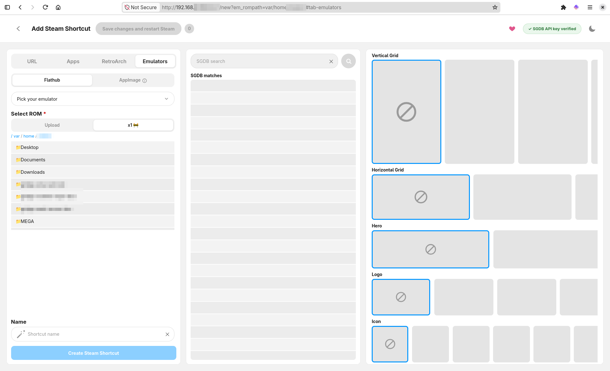

# SelfSteam

A headless companion, a small web UI for adding Steam shortcuts (with SteamGridDB artwork) from another device, while the target machine stays in Steam's Game Mode. Just add rom, restart Steam and play.

> [!NOTE]
> Flathub repo is needed for the GNOME runtime dependency, RetroArch and emulators.

## Feaures

- [x] Add streaming or any websites as a Steam shortcut
- [x] Retrieve game or app artwork from [SteamGridDB](https://www.steamgriddb.com/) vast community database (you'll need to provide your own API key)
- [ ] Install other game launchers and apps
- [x] Upload retro games roms and SS will take care of looking for artwork and adding Steam shortcut
- [x] Upload .isos, keys and firmware files from SS to add more modern console games.
- [x] Add/edit your non Steam shortcuts
- [x] Web UI running from your Steam Deck / Steam Machine in game mode, desktop mode is only needed to install app
- [x] Screen code authentication
- [x] Install emulators from flathub and appimages from developers source
- [x] Auto update flatpak

## To be done
- [ ] App icon
- [ ] Test all emulators, around 80% of them only have been tested.
- [ ] Add other game launchers + utilities
- [ ] More testing and polishing
- [ ] Marry [preflight](https://github.com/ScarletPachydermDev/Preflight) to this project to avoid controller layout issues in emulators (if viable)

## How to install
Run on your terminal

`flatpak remote-add --user --if-not-exists flathub https://dl.flathub.org/repo/flathub.flatpakrepo && flatpak remote-add --user --if-not-exists selfsteam https://raw.githubusercontent.com/ScarletPachydermDev/SelfSteam/master/packaging/io.github.ScarletPachydermDev.SelfSteam.flatpakrepo && flatpak install --user selfsteam io.github.ScarletPachydermDev.SelfSteam`

## Friend projects

SelfSteam doesn't vendor code from any of these, but real behavior/patterns here were confirmed by actually reading their own source, not guessed -- each one credited in the relevant file's own comments too:

- **[ChimeraOS](https://github.com/ChimeraOS/chimera)** -- the pairing-code auth screen's layout (`chimera_app/authenticator.py`) and the confirmed reason Steam needs to be fully stopped before writing `shortcuts.vdf` (its own periodic re-save silently clobbers an in-place edit).
- **[emerytech/couchside](https://github.com/emerytech/couchside)** -- the same no-accounts, code-on-screen pairing pattern.
- **[ChimeraOS/gamescope-session](https://github.com/ChimeraOS/gamescope-session)** (its bundled `gamescope-fg` tool) -- the `STEAM_GAME`/`GAMESCOPECTRL_BASELAYER_APPID` X11 mechanism `gamescope_splash.py` reimplements directly, so this has no runtime dependency on it being installed.
- **[Jellyfin's own Flatpak](https://github.com/flathub/org.jellyfin.JellyfinServer)** -- confirmed the real, working shape for a background-service Flatpak (a sandbox can't touch `~/.config/systemd/user`/`systemctl` itself, so setup has to happen through an escape hatch or a copy-paste script).
- **[SteamGridDB/steam-rom-manager](https://github.com/SteamGridDB/steam-rom-manager)** -- Artwork source and `_ra_guess_name_from_filename`'s ROM-filename cleanup is a ported version of its own `fuzzy-matcher.ts`.
- **[mateussouzaweb/nicedeck](https://github.com/mateussouzaweb/nicedeck)**

## Donate

bitcoin: bc1qw5d4wyc4szjz28e6tafmpd4u9flgqqnjlwuwd8

monero: 89GucTETmNEUVdbF3HYWYC8Gi3mFdUFvyEaa545E4S8ahq2MfXmGgMzS5q9Kx6k3DG943gXFbn4ECTQFf8Coe5qyEfwxAdM

## License

[FSL-1.1-MIT](LICENSE) -- free for any non-competing use (personal use, internal use, non-commercial education/research); converts automatically to plain MIT two years after each version is released.
